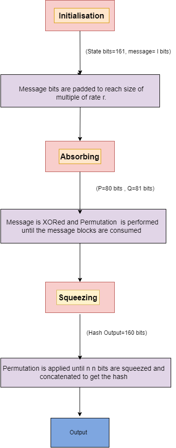
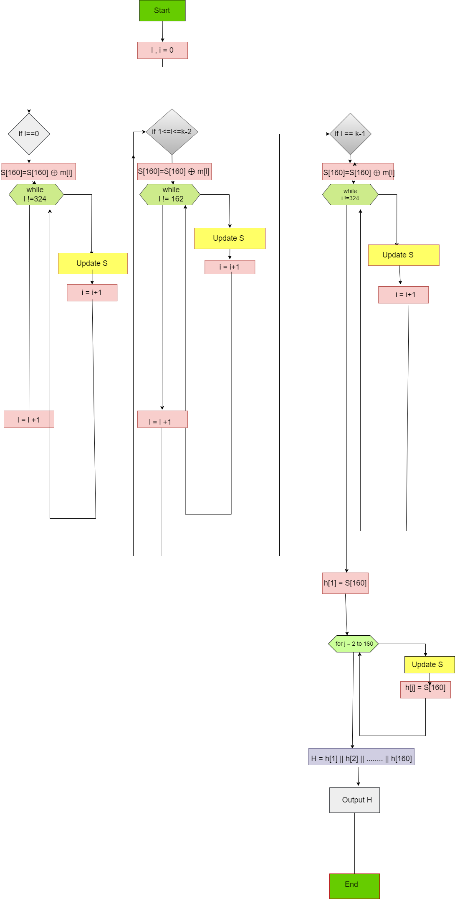

# Modern Cryptography

    
  

## Implementation of Hash-one 

| Members | 
|:-------:|
| Chitla Vyshali | 
| Charan K | 
| Chinni Nagasree Hansica |
| Deepak Kumar S |

Mentor: Mr. Ramaguru Radhakrishnan, Asst. Professor (Senior Grade)

### Background

#### Hash-One

##### Scheme
- Sponge construction:
  - Sponge Function
- Transitional permutation:
  - Two NFSRs
- Update Function:
  - Two 4-Variable Non-Linear Boolean functions
  - A Linear function in three variables
 
  

   
 
  

 ##### Working 

 

   
 

### Deliverables
- [User Interface](https://re-bin-d-22ucys.github.io/Modern-Cryptography/Project/Team_5/ui/)
- [FAQ]()

#### References
- Megha Mukundan, P., Manayankath, S., Srinivasan, C., & Sethumadhavan, M. (2016). Hash‐One: a lightweight cryptographic hash function. IET Information Security, 10(5), 225-231.
